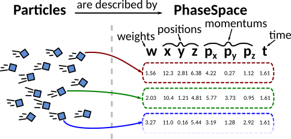
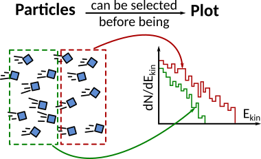
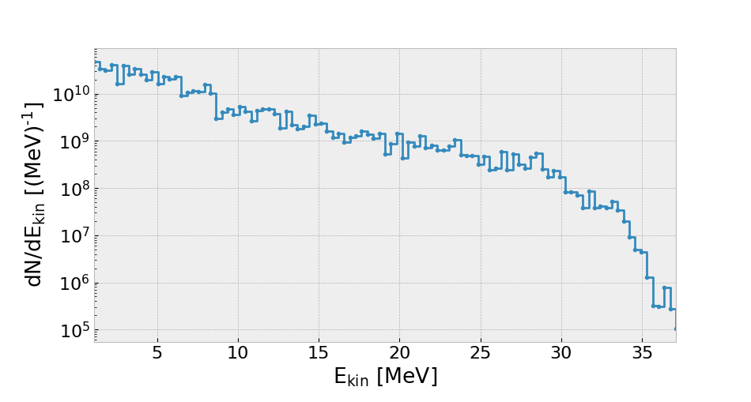
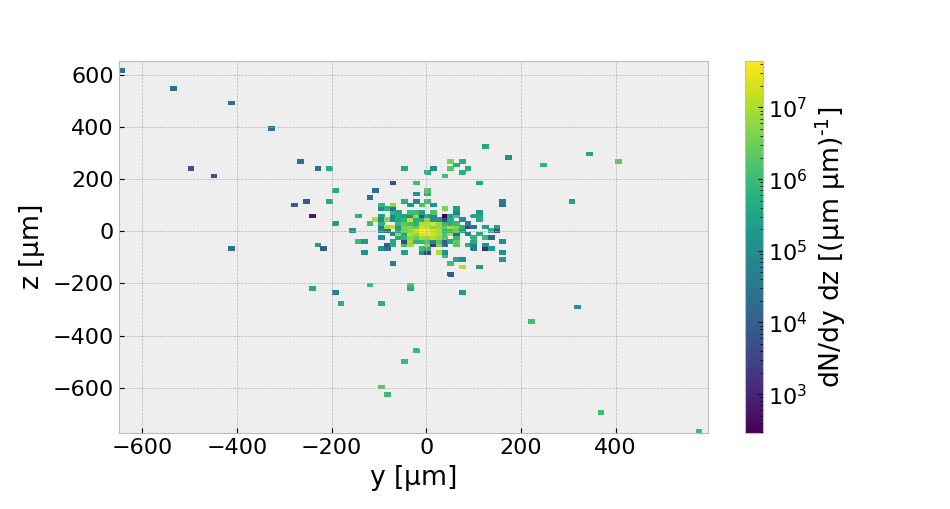

# Particle Phase Space (and fields) Analysis Toolkit

p2sat is an open source, object-oriented Python3 module for numerical physics data analysis. It has been designed to treat particle phase space data, independently from the sources of the data.

## Principle

To describe a set of "free-propagating" particles (no external electromagnetic or gravitational fields), the most precise way to do it is to get a list of all the particle's positions and momentums at given time. In numerical physics, a simulated particle can also represent a large amount of real particles, so we can add a statistical weight to this set of data. What we call particle "phase-space" is then a set of statistical weight `w`, position `x,y,z`, momentum `px,py,pz` and time `t` for each particle of the simulation.



Despite being precise, this approach is however not always adopted by physicists because particle phase-space need a "large" data analysis, often to calculate ... ekin ... .

The phase-space approach can however lead to very fine treatments, such as select a quantity filtered by another, e.g. ...



p2sat has then been developed to simplify this kind of data treatment, independently from the data source,  and make histograms, plots and fits as easily as possible.

Space-time events (`w,x,y,z,t`) and scalar fields (`w,x,y,z,t` on grid) can also be treated the same way (yet experimental feature).

**Notes:**

- This module has been developed for Particle-In-Cell and Monte Carlo particle data analysis, but can be quite easily used with other kind of codes.
- If you're interested mainly on Particle-In-Cell data analysis, you can also look the postpic package

## Toolkit structure

**Core features:**

- Automatic conversion between related physics quantities (e.g. gamma factor from momentums, ...)
- Data filtering (e.g. select all the particles in a given volume or with given direction)
- Histogram making (1D, 2D, 3D) and data fits (1D)
- Plotting (1D to 3D histograms, scatter and contour plots) with automatic normalizations and legend
- Statistical tools (standard deviation, covariance, ...)
- Import data from simulation files (Smilei, Geant4, text files, ...)
- Unit management
- Low memory load


## Quick examples

**Initialize a PhaseSpace dataset for electron specie**

```python
>>> import p2sat
>>> eps = p2sat.datasets.PhaseSpace(specie="electron", unit_system="UHI")
```

**and load simulation results from a text file**.

```python
>>> eps.load.txt("ExamplePhaseSpace.dat")
```

**You can now access all the particle's properties (position, energy, ...) via the `read` sub-object.**

```python
>>> print(eps.read.ekin) 	# Kinetic energies (in MeV)
array([...])
>>> print(eps.read.gammax) 	# Lorentz factor projected on x axis
array([...])
>>> print(eps.read.rx) 		# Absolute distance to x axis (in um)
array([...])
```

**It is also possible to plot histograms, e.g. number of particles in term of their kinetic energy `ekin`**

```python
>>> p2sat.plot.hist1d(eps, "ekin", log=True)
```



**or the density map of electrons at axis `x=150 µm`.**

```python
>>> p2sat.plot.hist2d(eps, "y", "z", select={"x":150}, log=True, clear=True)
```



**The same can be done with scalar fields or space-time events (Not implemented yet !)**

```python
>>> loc = p2sat.datasets.EventLocation(unit_system="cgs-MeV")
>>> loc.load.txt("ExampleEventLocation.dat")
>>> p2sat.plot.contour2d(loc, "y", "z", select={"x":[1.50, 1.51], "t":[0,60]})
```


More informations can be found in the documentation. See file `docs/reference.pdf` or use `help(p2sat)` in an interactive python terminal.

## Installation

The most simple way to install p2sat is to use pip (https://pypi.org/project/p2sat/)

```bash
pip install --user p2sat
```

Otherwise, you can also clone the source code from github and install the package with the following commands

```bash
git clone https://github.com/lesnat/p2sat.git
cd p2sat
python setup.py install
```

If the installation is not working, you can [send us an issue]() and add the following lines at the beginning of your script

```python
p2sat_path="/path/to/p2sat/"
import sys
if p2sat_path not in sys.path: sys.path.append(p2sat_path)

import p2sat
```

The code is developed for Python3, and the only dependencies are packages `numpy` and `matplotlib` (even if `scipy` could be needed for some specific methods).

## Contributing

I developed this package during my PhD and I'll be very glad if it could be useful to someone, especially if anyone would be interested about helping me maintaining this toolkit. If interested you can contact me at ...

Load methods.

This work is released under GPLv3 licence.
