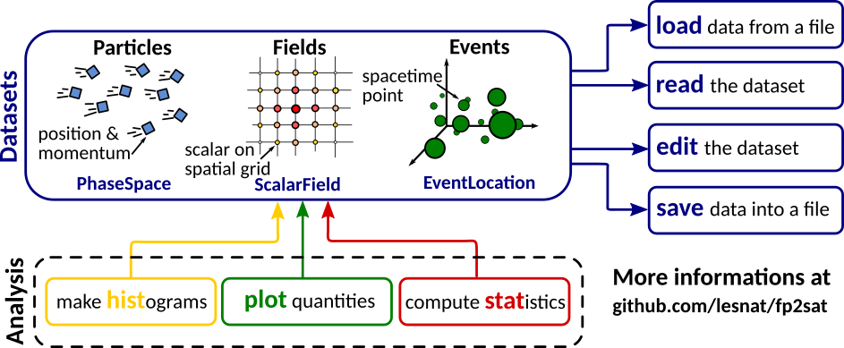

# Field and Particle Phase Space Analysis Toolkit

fp2sat is an open source, object-oriented Python3 module for numerical physics data analysis.

Its basic idea is to treat 

It has been firstly designed as a particle phase-space analysis toolkit for Particle-In-Cell and Monte Carlo particle data, but can now also treat space-time events and scalar fields from any data source.

Its basic idea is to 

**Notes:**

- This module has been developed for Particle-In-Cell and Monte Carlo particle data analysis, but can be quite easily used with other kind of codes.
- Based on p2sat, and similar to postpic

## Toolkit structure

**Core features:**

- Automatic conversion between related physics quantities (e.g. gamma factor from momentums, ...)
- Data filtering (e.g. select all the particles in a given volume or with given direction)
- Histogram making (1D, 2D, 3D) and data fits (1D)
- Plotting (1D to 3D histograms, scatter and contour plots) with automatic normalizations and legend
- Statistical tools (standard deviation, covariance, ...)
- Import data from simulation files (Smilei, Geant4, text files, ...)
- Low memory load




## Quick examples

**Initialize a PhaseSpace dataset for electron specie**

```python
>>> import fp2sat
>>> eps = fp2sat.datasets.PhaseSpace(specie="electron", unit_system="cgs-MeV")
```

**and load simulation results from a text file**.

```python
>>> eps.load.txt("ExamplePhaseSpace.dat")
```

**You can now access all the particle's properties (position, energy, ...) via the `read` sub-object.**

```python
>>> print(eps.read.ekin) 	# Kinetic energies
array([...])
>>> print(eps.read.gammax) 	# Lorentz factor projected on x axis
array([...])
>>> print(eps.read.rx) 		# Absolute distance to x axis
array([...])
```

**It is also possible to plot histograms, e.g. number of particles in term of their kinetic energy `ekin`**

```python
>>> fp2sat.plot.hist1d(eps, "ekin", log=True)
```


**or the density map of electrons in a slab along axis `x`.**

```python
>>> fp2sat.plot.hist2d(eps, "y", "z", select={"x":[1.50, 1.51]})
```


**The same can be done with scalar fields or space-time events (Not implemented yet !)**

```python
>>> loc = fp2sat.datasets.EventLocation(unit_system="cgs-MeV")
>>> loc.load.txt("ExampleEventLocation.dat")
>>> fp2sat.plot.contour2d(loc, "y", "z", select={"x":[1.50, 1.51], "t":[0,60]})
```


More informations can be found in the documentation. See file `docs/reference.pdf` or use `help(fp2sat)` in an interactive python terminal.

## Installation

The most simple way to install fp2sat is to use pip (https://pypi.org/project/p2sat/)

```bash
pip install --user fp2sat
```

Otherwise, you can also clone the source code from github and install the package with the following commands

```bash
git clone https://github.com/lesnat/fp2sat.git
cd fp2sat
python setup.py install
```

If the installation is not working, you can [send us an issue]() and add the following lines at the beginning of your script

```python
p2sat_path="/path/to/p2sat/"
import sys
if p2sat_path not in sys.path: sys.path.append(p2sat_path)

import p2sat
```

The code is developed for Python3, and the only dependencies are packages `numpy` and `matplotlib` (even if `scipy` could be needed for some specific methods).

## Contributing

I developed this package during my PhD and I'll be very glad if it could be useful to someone, especially if anyone would be interested about helping me maintaining this toolkit. If interested you can contact me at ...

Load methods.

This work is released under GPLv3 licence.