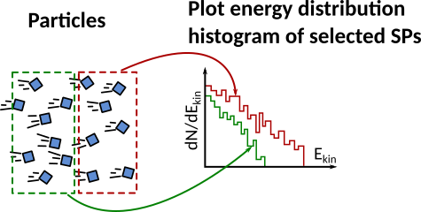

# Particle Phase Space Analysis Toolkit

*p2sat* is an open source, object-oriented Python3 module for numerical physics data analysis. It has been designed to deal with simulations results on particle's kinematics, independently from the source of the data.


## Principle

To describe the kinematics of free-propagating particles (no external electromagnetic or gravitational fields), one only needs all the particle's positions and momentums at a given time ; the positions at any time being computable using their momentums and Newton's law. In numerical physics, a simulated particle (= super-particle, SP) can also represent a large amount of real particles. We call this conversion factor the statistical weight of the super-particle.

In *p2sat*, we describe these super-particles by what we call particle phase-space, containing a list of the SPs statistical weights `w`, positions `x,y,z` and momentums `px,py,pz` at a given time `t`.


Considering given SPs phase-space, one could calculate other corresponding quantities more suitable to the physicist, such as the SPs total and kinetic energy, gamma factor or velocity, their angles along the propagation axis or their distance to propagation axis … 

In addition to unify the calculation of all these quantities on a single interface, this phase-space treatment approach also allow us to work only with SPs satisfying a given condition, such as a space selection (as illustrated in the next figure), or more generally a selection on any quantity (SPs at a given position, or exported at a given time, or in a given kinetic energy interval, …). A single dataset can then provide very rich informations about the simulated physics.



Despite being very usefull, this approach is however not always adopted by physicists since the treatment of these data is not really straightforward, and existing modules are not always adapted to a specific simulation code.

*p2sat* has been developed to simplify this kind of data treatment, independently from the data source, and give a help to make histograms, plots and fits as easily as possible.

Future developments are planned to study space-time events (`w,x,y,z,t`) and scalar fields (`w,x,y,z,t` on grid).

**Notes:**

- This module has been developed for Particle-In-Cell and Monte Carlo particle data analysis, but can be quite easily used with other kind of codes.
- If you're interested mainly on Particle-In-Cell data analysis, you can also look the [postpic](https://github.com/skuschel/postpic) package


## Toolkit structure

**Core features:**

- Automatic conversion between related physics quantities (e.g. gamma factor from momentums, ...)
- Data filtering (e.g. select all the particles in a given volume, or with given direction, …)
- Histogram making (1D, 2D, 3D) and data fits (1D)
- Plotting (1D to 3D histograms, scatter and contour plots) with automatic normalizations and legend
- Statistical tools (standard deviation, covariance, total energy in the dataset ...)
- Import data from simulation files (Smilei, Geant4, text files, ...)
- Unit management
- Low memory load


## Quick examples

**Initialize a PhaseSpace dataset for electron specie**

```python
>>> import p2sat
>>> eps = p2sat.datasets.PhaseSpace(specie="electron", unit_system="cgs-MeV")
```

**and load simulation results from a text file**.

```python
>>> eps.load.txt("ExamplePhaseSpace.dat")
```

**You can now access all the particle's properties (position, energy, ...) via the `read` sub-object.**

```python
>>> print(eps.read.ekin) 	# Kinetic energies (in MeV)
array([...])
>>> print(eps.read.gammax) 	# Lorentz factor projected on x axis
array([...])
>>> print(eps.read.rx) 		# Absolute distance to x axis (in cm)
array([...])
```

**It is also possible to plot histograms, e.g. number of particles in term of their kinetic energy `ekin`**

```python
>>> p2sat.plot.hist1d(eps, "ekin", log=True)
```


**or the density map of electrons at axis `x=150 µm`.**

```python
>>> p2sat.plot.hist2d(eps, "y", "z", select={"x":150}, log=True, clear=True)
```


**The same can be done with scalar fields or space-time events (Not implemented yet !)**

```python
>>> loc = p2sat.datasets.EventLocation(unit_system="cgs-MeV")
>>> loc.load.txt("ExampleEventLocation.dat")
>>> p2sat.plot.contour2d(loc, "y", "z", select={"x":[1.50, 1.51], "t":[0,60]})
```


More informations can be found in the documentation. See file `docs/reference.pdf` or use `help(p2sat)` in an interactive python terminal.


## Installation

The easiest way to install p2sat is to use pip (https://pypi.org/project/p2sat/).

```bash
pip install --user p2sat
```

Otherwise, you can also get the source code from github

```bash
wget https://github.com/lesnat/p2sat/archive/master.zip
unzip master.zip
```

and add the following lines at the beginning of your script

```python
p2sat_path="/path/to/p2sat-master/"
import sys
if p2sat_path not in sys.path: sys.path.append(p2sat_path)

import p2sat
```

If you need to work with up-to-date developments of *p2sat*, the second option is recommended.

The code is developed for Python3, and the only dependencies are packages `numpy` and `matplotlib` (even if `scipy` could be needed for some specific methods).


## Contributing

I developed this package during my PhD and I'll be very glad if it could be useful to someone, especially if anyone would be interested about helping me maintaining this toolkit ! <!--If interested you can contact me at ... Load methods.-->

This work is released under GPLv3 licence.
